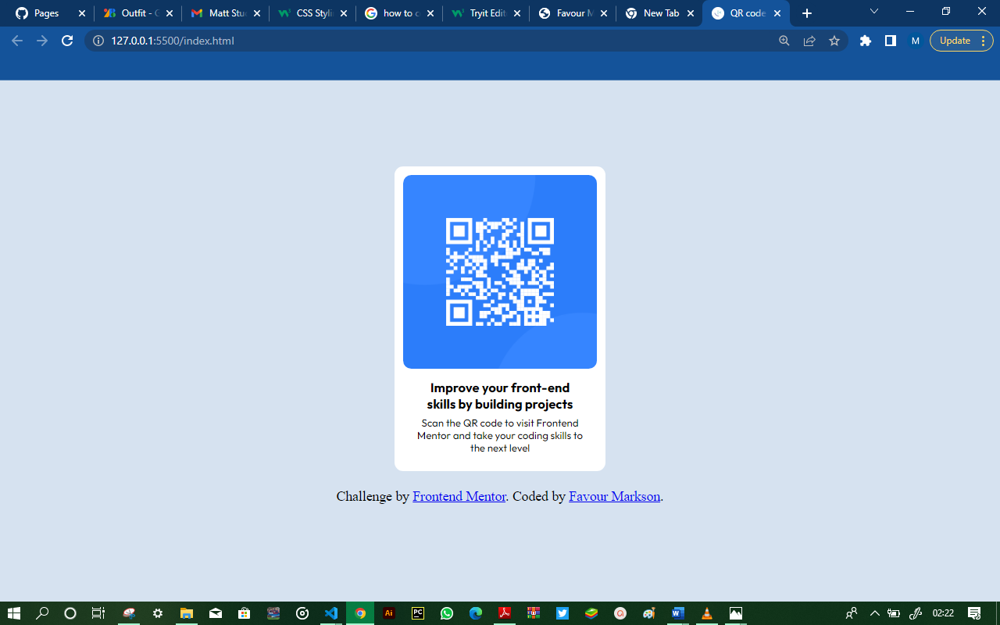

# Frontend Mentor - QR code component solution

This is a solution to the [QR code component challenge on Frontend Mentor](https://www.frontendmentor.io/challenges/qr-code-componentg-iux_sIO_H). Frontend Mentor challenges help you improve your coding skills by building realistic projects. 

## Table of contents

- [Overview](#overview)
  - [Screenshot](#screenshot)
  - [Links](#links)
- [My process](#my-process)
  - [Built with](#built-with)
  - [What I learned](#what-i-learned)
  - [Useful resources](#useful-resources)
- [Author](#author)

## Overview

### Screenshot

### Links

- Solution URL: [The github repository to the solution ](https://github.com/Markson17/QR-CODE/)
- Live Site URL: [Github live site url](https://your-live-site-url.com)

## My process

### Built with

- Semantic HTML5 markup
- CSS custom properties
- [Outfit]https://fonts.google.com/specimen/Outfit - For styles

### What I learned

I learnt how to center a parent class and also how to place the image at the right spot as it was designed.

### Useful resources

- (https://www.w3schools.com/css/css3_images.asp) - This is an amazing article which helped me finally understand how to place images at the right place. I'd recommend it to anyone still learning this concept.

## Author

- Website - [Favour Markson](https://favour-markson-resume.herokuapp.com/)
- Frontend Mentor - [@Markson17](https://www.frontendmentor.io/profile/Markson17)
- Twitter - [@MarksonFavour1](https://www.twitter.com/MarksonFavour1)

